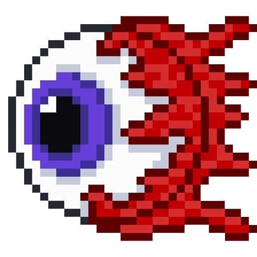

 
 
 

 
# Olá, me chamo Pedro Luiz!      

Sou estudante de Análise e Desenvolvimento de Sistemas na Faculdade de Engenharia de Sorocaba (FACENS) e técnico em Desenvolvimento de Sisemas pela ETEC Fernando Prestes. Amo tecnologia - uma área que me fascina por requerer um alto nível de pensamento lógico. Vejo essa área como uma das mais importantes do mundo, tendo em vista que todas as outras dependem dela de alguma forma.

#

<h3>💻 Tech Stack</h3>

  
                 

#
  

 

<h3>📊 GitHub Stats</h3>

