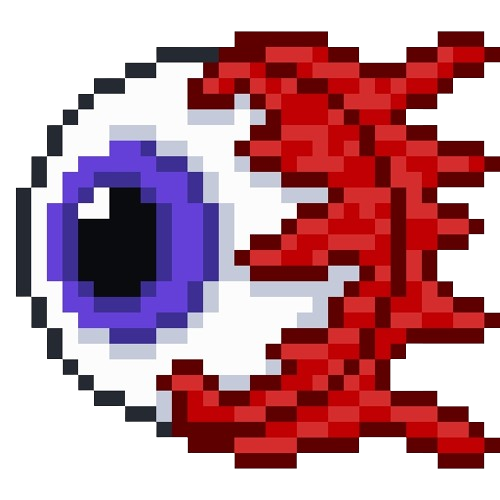

 
 
 

 
# Olá, me chamo Pedro Athayde!      

Sou um Engenheiro de Software Backend movido pela paixão por tecnologia e pelo desafio de resolver problemas reais de alta complexidade. Formado pela FACENS, encaro a engenharia de software não apenas como lógica, mas como uma ferramenta poderosa para gerar impacto e segurança em larga escala.

Atualmente, aplico essa visão no **Mercado Livre**, atuando no time de **Platform Security (PlatSec)**. Assumo a responsabilidade sobre fluxos críticos de autorização, permissões e roles que sustentam todo o ecossistema do Meli, garantindo que as operações ocorram de forma segura e ininterrupta.

Acredito que a excelência técnica é fundamental para entregar valor real. Por isso, minha rotina envolve atuar de ponta a ponta no ciclo de vida do software: desde o design arquitetural e desenvolvimento (predominantemente em **Golang** e **Java**), até o processo de deploy, monitoramento e análise de métricas para garantir resiliência absoluta em sistemas distribuídos.

**Focos atuais e expertise:**
- Construção de APIs Restful resilientes e de alta disponibilidade.
- Observabilidade e monitoramento contínuo utilizando **Datadog** e **Grafana**.
- Arquitetura limpa (Hexagonal Architecture), testes automatizados e princípios SOLID.
- Cultura DevOps e deploy em ambientes de alta criticidade.

#

<h3>💻 Tech Stack</h3>

**Linguagens & Frameworks**  
  

**Infraestrutura & Observabilidade**  
    

**Bancos de Dados & Ferramentas**  
     
#
  

 

<h3>📊 GitHub Stats</h3>

